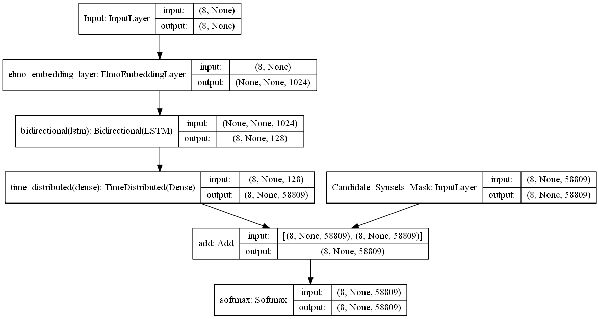
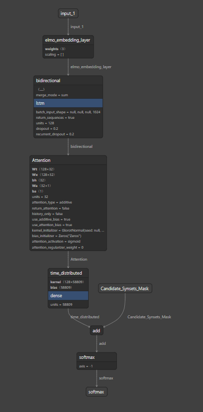
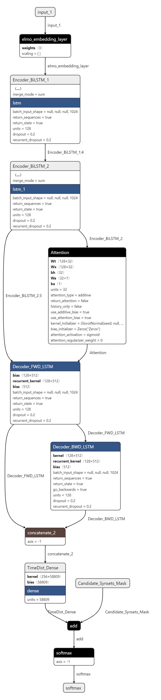

# Word Sense Disambiguation

## To Use the repo

- Install requirements first `pip install -r requirements.txt`
- configure using configuration file `config.yaml`
- Run `py code/model.py --model_type baseline --single_task_models True`

---

## Data

Datasets and examples

### English

- [comprehensive WSD Framework](http://lcl.uniroma1.it/wsdeval/) by Raganato et al.

  - Training & Prediction `.xml` files in the following format
    - 
  - `.gold.key.txt`
    - 

### Multilingual

- [Train-o-Matic](trainomatic.org/index.html)
  - Download dataset and parse it

- [OneSec](trainomatic.org/index.html)
  - Download dataset and parse it

---

## WSD Approaches

<summmary>Approaches</summmary>
- WSD is approached in 2 main approaches
  1. Deep Approaches
     - limited in success, as sentences cant be found in computer-readable format except in very limited domains
  2. Shallow Approaches
     - presumes no need of understanding the text, just consider the surrounding words
- Four conventional approaches to WSD, some people group it to supervised (or semi supervised) and Knowledge-based
  1. Knowledge-based
  2. Semi-Supervised
  3. Supervised
     - Make use of sense annotated corpora
  4. Unsupervised
     - Use unannotated corpora, AKA Word Sense Discrimination
- Almost all of them work by defining a window of `n` content words around each word to be disambiguated and statistically analyzing those `n` words

### 1. Knowledge Based

- seminal dictionary-based method. It is based on the hypothesis that words used together in text are related to each other and that the relation can be observed in the definitions of the words and their senses. Two (or more) words are disambiguated by finding the pair of dictionary senses with the greatest word overlap in their dictionary definitions.
- A similar approach searches for the shortest path between two words: the second word is iteratively searched among the definitions of every semantic variant of the first word, then among the definitions of every semantic variant of each word in the previous definitions and so on. Finally, the first word is disambiguated by selecting the semantic variant which minimizes the distance from the first to the second word.
- An alternative to the use of the definitions is to consider general word-sense relatedness and to compute the semantic similarity of each pair of word senses based on a given lexical knowledge base such as WordNet.

### 2. Supervised methods

- Supervised methods are based on the assumption that the context can provide enough evidence on its own to disambiguate words, hence, common sense and reasoning are deemed unnecessary. Probably every machine learning algorithm going has been applied to WSD, including associated techniques such as feature selection, parameter optimization, and ensemble learning. Support Vector Machines and memory-based learning have been shown to be the most successful approaches, to date, probably because they can cope with the high-dimensionality of the feature space.
- However, these supervised methods are subject to a new knowledge acquisition bottleneck since they rely on substantial amounts of manually sense-tagged corpora for training, which are laborious and expensive to create.

### 3. Semi Supervised methods

- Because of the lack of training data, many word sense disambiguation algorithms use semi-supervised learning, which allows both labeled and unlabeled data.
- The bootstrapping approach starts from a small amount of seed data for each word: either manually tagged training examples or a small number of surefire decision rules (e.g., 'play' in the context of 'bass' almost always indicates the musical instrument). The seeds are used to train an initial classifier, using any supervised method. This classifier is then used on the untagged portion of the corpus to extract a larger training set, in which only the most confident classifications are included. The process repeats, each new classifier being trained on a successively larger training corpus, until the whole corpus is consumed, or until a given maximum number of iterations is reached.

- Other semi-supervised techniques use large quantities of untagged corpora to provide co-occurrence information that supplements the tagged corpora. These techniques have the potential to help in the adaptation of supervised models to different domains.

- Also, an ambiguous word in one language is often translated into different words in a second language depending on the sense of the word. Word-aligned bilingual corpora have been used to infer cross-lingual sense distinctions, a kind of semi-supervised system.

### 4. Unsupervised methods

- is the greatest challenge for WSD researchers. The underlying assumption is that similar senses occur in similar contexts, and thus senses can be induced from text by clustering word occurrences using some measure of similarity of context, a task referred to as word sense induction or discrimination. Then, new occurrences of the word can be classified into the closest induced clusters/senses. Performance has been lower than for the other methods described above, but comparisons are difficult since senses induced must be mapped to a known dictionary of word senses. If a mapping to a set of dictionary senses is not desired, cluster-based evaluations (including measures of entropy and purity) can be performed. Alternatively, word sense induction methods can be tested and compared within an application. For instance, it has been shown that word sense induction improves Web search result clustering by increasing the quality of result clusters and the degree diversification of result lists. It is hoped that unsupervised learning will overcome the knowledge acquisition bottleneck because they are not dependent on manual effort.

- The above info is collected from [tutorials-point](https://www.tutorialspoint.com/natural_language_processing/natural_language_processing_word_sense_disambiguation), and [Wikipedia](https://en.wikipedia.org/wiki/Word-sense_disambiguation), [NLP-Progress](http://nlpprogress.com/english/word_sense_disambiguation.html)

---

- First of all, obtaining reliable sense-annotated corpora is highly expensive and especially difficult when non-expert annotators are involved, and as a consequence approaches based on unlabeled data and semi-supervised learning are emerging
- Apart from the shortage of training data, a crucial limitation of current supervised approaches is that a dedicated classifier (word expert) needs to be trained for every target lemma, making them less flexible and hampering their use within end-to-end applications.
- In contrast, knowledge-based systems do not require sense-annotated data and often draw upon the structural properties of lexicosemantic resources. Such systems construct a model based only on the underlying resource, which is then able to handle multiple target words at the same time and disambiguate them jointly, whereas word experts are forced to treat each disambiguation target in isolation.
  

---

## Model

Models' Details

- various neural architectures of different complexities, ranging from a single bidirectional Long Short-Term Memory (Bi-LSTM) to a sequence-to-sequence approach. Each architecture reflects a particular way of modeling the disambiguation problem, but they all share some key features that set them apart from previous supervised approaches to WSD: they are trained end-to-end from sense-annotated text to sense labels, and learn a single all-words model from the training data, without fine tuning or explicit engineering of local features.

### 1. Bidirectional LSTM [BLSTM]

- It is basically a sequential model, starts with an embedding layer followed by a Bidirectional LSTM, and ends with a TimeDistributed Dense layer (num of classes depends on the output vocabulary size, which is the word tokens + sense tokens)

- This model can be a stacked bidirectional LSTM if we added another BiLSTM layer

### 2. Attention Stacked Bidirectional LSTM [Att+BiLSTM]

- Same as the previous model, but this one has 2 BiLSTM layers, followed by an Attention layer, and the output of the Attention Layer is passed to the TimeDistributed Dense Layer (just like the previous model)
  
  

### 3. Sequence-to-Sequence Model [AttenSeq2Seq]

- It is about training models to convert sequences from one domain (e.g. sentences in English) to sequences in another domain (e.g. the same sentences translated to French). this is an example of NMT (Neural Machine Translation). This can be decomposed into 2 cases a trivial one where the input sequence and the output sequence are of the same length, the other case which they are not of equal lengths
- How it works?
  - it requires a layer known as Encoder (RNN Layer): it processes the input sequence and returns its own internal state. Note that we discard the outputs of the encoder RNN, only recovering the state. This state will serve as the "context", or "conditioning", of the decoder in the next step.
  - Another layer acts as Decoder (Another RNN Layer): it is trained to predict the next characters of the target sequence, given previous characters of the target sequence. Specifically, it is trained to turn the target sequences into the same sequences but offset by one timestep in the future, a training process called "teacher forcing" in this context. Importantly, the encoder uses as initial state the state vectors from the encoder, which is how the decoder obtains information about what it is supposed to generate. Effectively, the decoder learns to generate targets[t+1...] given targets[...t], conditioned on the input sequence.
- In inference mode, i.e. when we want to decode unknown input sequences, we go through a slightly different process:

  1. Encode the input sequence into state vectors.
  2. Start with a target sequence of size 1 (just the start-of-sequence character).
  3. Feed the state vectors and 1-char target sequence to the decoder to produce predictions for the next character.
  4. Sample the next character using these predictions (we simply use argmax).
  5. Append the sampled character to the target sequence
  6. Repeat until we generate the end-of-sequence character or we hit the character limit.

- Because the training process and inference process (decoding sentences) are quite different, we use different models for both, albeit they all leverage the same inner layers.

  
  

---

- Repo was implemented following functional paradigm
